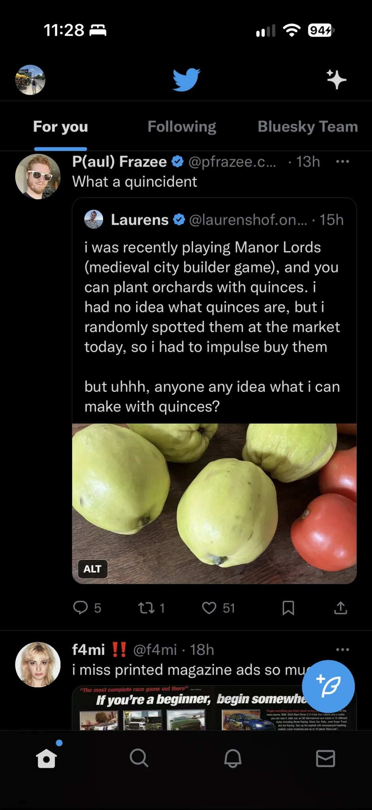
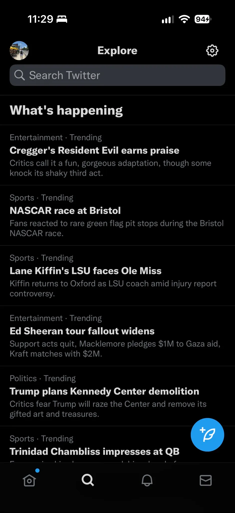
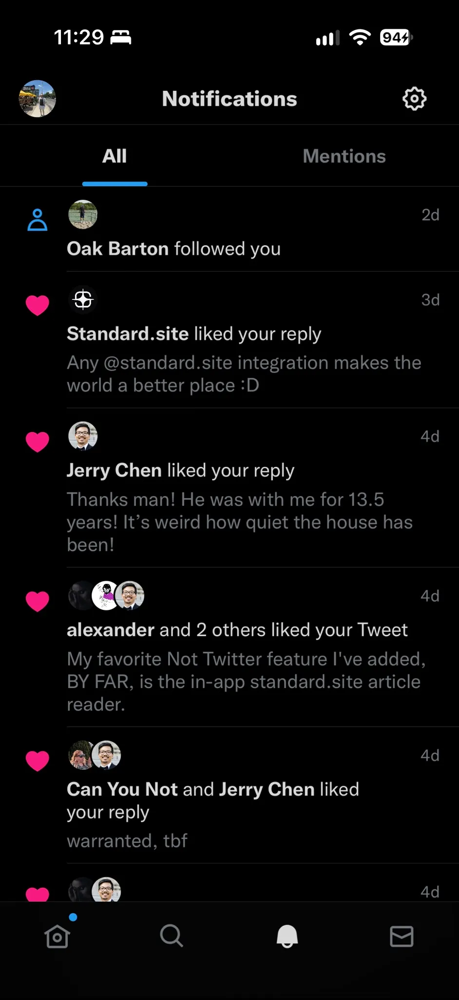

# Not Twitter ATProto App

This is a clean standalone iOS app for the Bluesky-backed Not Twitter build. It does not inject into the Twitter/X app and it does not ship any Twitter networking code.

The app is native UIKit: Home, Explore, Notifications, Profile, and Compose are rendered on-device and backed by ATProto XRPC calls.

## Installation

To install Not Twitter on your iPhone, you’ll need to **sideload the `.ipa` file** using a tool such as:

- [SideStore](https://sidestore.io/)
- [AltStore Classic](https://altstore.io/)

Follow the setup instructions on your chosen tool’s official website, then import the Not Twitter IPA to sign and install it. Other compatible IPA sideloading tools can also be used.

## Screenshots

| Home | Explore | Notifications |
| :---: | :---: | :---: |
|  |  |  |

## Building from source

The supported build helper runs on Linux and uses Theos to compile the native
Objective-C/UIKit app. The current target is **arm64**, with the **iOS 16.5 SDK**
and an **iOS 14.0 deployment target**. The IPA still needs device signing through
a sideloading tool before it can run on an iPhone.

### Requirements

- Git, Bash, GNU Make, and the standard command-line tools used by Theos, including ZIP utilities.
- [Theos with its Linux iOS cross-compilation toolchain](https://theos.dev/docs/installation-linux).
- An `iPhoneOS16.5.sdk` SDK directory accessible to Theos.
- `ldid` available on your `PATH` for the build’s signing step.
- Optional: [xtool](https://xtool.sh/) and its runtime dependencies for signing and installing directly over USB. You can instead sideload the resulting IPA with SideStore or AltStore Classic.

Follow the Theos installation guide to set up the build system and toolchain
before running the commands below. The repository does not bundle the SDK,
Theos, or xtool.

### Clone and configure

```bash
git clone https://github.com/NotTwitterApp/NotTwitter-iOS.git
cd NotTwitter-iOS

# Adjust these paths to match your installed Theos and iOS SDK.
export THEOS="$HOME/theos"
export SDKROOT="$THEOS/sdks/iPhoneOS16.5.sdk"
export PATH="$THEOS/bin:$PATH"

# Confirm that the required SDK and signing tool are available.
test -d "$SDKROOT"
command -v ldid
```

If `ldid` is installed elsewhere, add its directory to `PATH`. Without explicit
`THEOS` and `SDKROOT` values, `build-linux.sh` looks for
`../_build/theos` and `../_build/sdks/iPhoneOS16.5.sdk`, relative to the repository.
It also prepends `../_build/bin` to `PATH`; that directory is optional when your
tools are already on `PATH`.

### Create the IPA

```bash
./build-linux.sh
```

The helper performs a clean release build and packages the app in `packages/`.
For version 1.2, the output is:

```text
packages/com.nottwitter.atproto_1.2.ipa
```

Import that IPA into your preferred sideloading tool. A successful build confirms
compilation and packaging; device behavior needs to be tested separately.

### Install directly with xtool

Connect and unlock your iPhone, trust the computer when prompted, and configure
xtool using its official setup instructions. With xtool available on `PATH`:

```bash
xtool auth login
xtool devices
./build-linux.sh --install --udid YOUR_CONNECTED_DEVICE_UDID
```

Replace `YOUR_CONNECTED_DEVICE_UDID` with the identifier reported by
`xtool devices`. To install an IPA you already built:

```bash
xtool install --usb --udid YOUR_CONNECTED_DEVICE_UDID \
  packages/com.nottwitter.atproto_1.2.ipa
```

By default, the helper leaves the IPA bundle identifier as `com.nottwitter.atproto`
and lets xtool rewrite/sign it exactly once. Only set `XTOOL_BUNDLE_ID` when you
need to force a specific explicit Apple Developer App ID.

If xtool fails before listing devices with a missing shared-library error,
repair its runtime dependencies before retrying installation. Packaging the IPA
with `./build-linux.sh` does not require xtool.

### Versioning

For a release, keep `CFBundleShortVersionString` in `Resources/Info.plist` and
`Version` in `control` in sync. Increment `CFBundleVersion` in
`Resources/Info.plist` for each new build. This release is **1.2, build 156**.

## Bookmark search

Search Bookmarks filters saved post text as you type and loads older pages while
searching. Use `from:alice` (short for `alice.bsky.social`),
`from:@alice.bsky.social`, or a full custom-domain handle such as
`from:alice.example` to filter by author. Combine it with text, for example
`from:alice coffee`. Multiple `from:` filters match any of the named authors.
Put text such as `"from:alice"` in quotes to search for it literally.

## Native networking

The native session layer uses Bluesky OAuth with DPoP and talks to:

```text
https://nottwitterapp.github.io/oauth/neofreebird-client-metadata.json
io.github.nottwitterapp:/not-twitter/oauth/neofreebird-callback
https://bsky.social
https://api.bsky.app
```

There is no WebView frontend wrapper in the app target.

## APNs setup

The native app already requests a device token through `UIApplication registerForRemoteNotifications`, stores the latest token, and registers it with Bluesky using `app.bsky.notification.registerPush`. The `appId` sent to Bluesky is the installed bundle identifier, so the Apple Developer App ID, provisioning profile, APNs topic, and installed bundle ID must all match.

For a normal Apple Developer build, create an explicit App ID for:

```text
com.nottwitter.atproto
```

Enable Push Notifications for that App ID, create a development provisioning profile with the target device included, and sign with an entitlement containing:

```xml
<key>aps-environment</key>
<string>development</string>
```

For a forced explicit bundle identifier, override it before running the helper:

```bash
XTOOL_BUNDLE_ID=com.nottwitter.atproto ./build-linux.sh --install --udid YOUR_CONNECTED_DEVICE_UDID
```

For TestFlight or App Store builds, use a production provisioning profile and change the entitlement environment to `production`.

## Session renewal

OAuth responses persist `expires_in` as an absolute expiry per account. Older
saved sessions fall back to the access JWT's expiry; opaque tokens without expiry
metadata are refreshed conservatively. Foreground entry, the maintenance timer,
and authenticated requests all use the same refresh coordinator.

Refreshes are coalesced per account, and rotated credentials are stored only if
the original refresh token and DPoP key still match. JSON and media-upload retries
retain their originating account/key, and a late 401 reuses an already-rotated
access token. Failed refreshes retain the saved session and have a 60-second
cooldown. The maintenance timer runs while iOS schedules the app; foreground and
request checks handle resuming after suspension.

Run the portable timing-policy checks:

```bash
cc -Wall -Wextra -Werror tests/token-refresh-policy.c -lm -o /tmp/nfb-token-refresh-policy
/tmp/nfb-token-refresh-policy
```

These checks exercise the production timing policy, not iOS networking or account
switch concurrency. Those paths require device/simulator integration testing.
Server-side revocation or the authorization server's maximum session lifetime can
still require signing in again.

## Acknowledgments

Special thanks to [@actuallyaridan](https://github.com/actuallyaridan) and the
[NeoFreeBird team](https://neofreebird.com/docs/) for their work on NeoFreeBird
and the inspiration it provided for Not Twitter.
